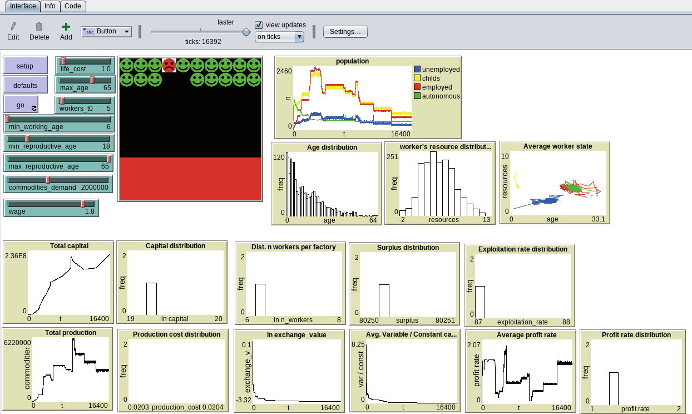

# Das Kapital

## WHAT IS IT?

Model representing the processes described in
"[Capital. A Critique of Political Economy](https://www.marxists.org/archive/marx/works/1867-c1/index.htm)" (Karl Marx
1867, 1885, 1894).

## HOW IT WORKS

Each cell represents means of production  and the workers are represented by individuals that can move among cells. In
the beginning, the cells are communal lands in which individuals subsist with the value generated by their own labor
without intermediaries. In the bottom row, the means of production are controlled by capital and there is wage labor
that produces commodities. As capital is reproduced and accumulated, it can expand into the cell immediately above. The
number of wage workers who can work there and the productivity of labor hours increase exponentially as capital expands
into the upper ranks, representing the technological development of the means of production.

### Workers

In each cycle, workers spend the resources needed to live ("life_cost"). Workers can be in different states. If they
work on communal land they are autonomous and earn twice the resources needed to survive, which allows them to
reproduce. If they are employed, they receive a salary/resources equivalent to "wage * life_cost". Each cell has a
maximum number of workers that depends on the level of development of the means of production and the capital available
to purchase the labor force. Workers who can't find work are unemployed and survive on whatever savings they may have.
If they are younger than the minimum working age ("min_working_age"), they are children who do not work and subsist on
the resources passed down to them by the family at birth. Workers who run out of resources at the end of a cycle die.

### Capital

In each cycle, capital produces a quantity of goods determined by the number of workers it can hire depending on the
available capital, and the productivity of the production system. The price of commodities is twice the socially
necessary value (the average cost of production weighted by the quantity of commodities produced for each unit of
production) to produce one unit.

In the event that the production of goods exceeds the demand, only the capital of the goods of the cells with the lowest
production cost is realized until all the demand is covered (https://en.wikipedia.org/wiki/Matthew_effect).

The color of the cells indicates the accumulated capital. The lighter the color, the more accumulated money, and black
color indicates 0 money.

## HOW TO USE IT

(how to use the model, including a description of each of the items in the Interface tab)
TODO

## THINGS TO NOTICE

Capital increases and develops. When new production systems increase productivity, the exchange value of commodities
falls. The less efficient modes of production cannot produce at a cost below exchange value and are abandoned (red
cells). When total production exceeds demand, less productive cells are decapitalized and have no capital to hire
workers, causing production to stop. The simulation usually stabilizes in a monopoly of one or several companies at the
maximum level of productivity, depending on the demanded amount for commodities.

## THINGS TO TRY

(suggested things for the user to try to do (move sliders, switches, etc.) with the model)

https://en.wikipedia.org/wiki/Internal_contradictions_of_capital_accumulation
https://en.wikipedia.org/wiki/Hyperinflation
https://en.wikipedia.org/wiki/Capital_accumulation

## EXTENDING THE MODEL

Add different types of commodities, commodities' production chains, trade unions, taxes, finite natural resources that
condition the market value of constant capital, demand for commodities based on total population, financial system,
international trade, imperialism...

## RELATED MODELS

(models in the NetLogo Models Library and elsewhere which are of related interest)
TODO

# Running the model
To see and run the model, install [NetLogo](https://ccl.northwestern.edu/netlogo/download.shtml) and open the
[file](exec/Das_Kapital.nlogo).

At the top, there is a `Info` tab describing the model, and `Code` tab with the code. To run the model, just click on
`setup` and `go`.
